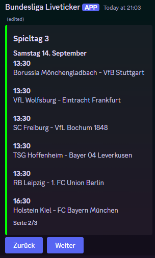
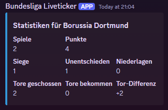
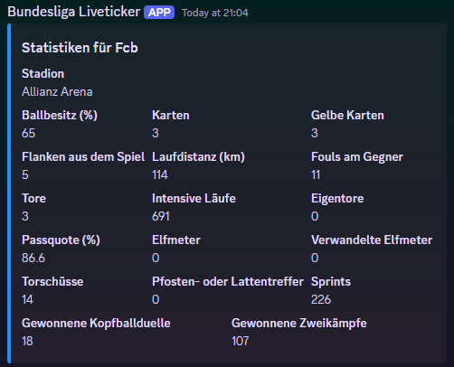

# Discord Bundesliga Bot

English version below

Es gibt Commands wie: 

/spielplan <Mannschaft oder Spieltag>, damit kann man entweder den Spielplan von einer ganzen Mannschaft sehen oder den Spielplan von einem bestimmten Spieltag

/statistiken <Mannschaft>, da sieht man die Statistiken, von der Tabelle, einer gewissen Mannschaft 

/mannschaft <Mannschaft>, bei dem Command werden die allgemeinen Statistiken der eingegebenen Mannschaft gezeigt

Noch mehr Commands kannst du auf dem [Discordserver](https://discord.gg/UMGHwsV2q5) ausprobieren oder du lädst den Bot selber auf deinen Server mit dem [Link](https://discord.com/oauth2/authorize?client_id=1277140018648977409) ein und probierst ihn dann

Für Programmierer: 
Um den Bot auf deinen Server laufen zu lassen musst du folgende Schritte beachten:
- Python3 muss installiert sein (du kannst das mit "python3 --version" testen)
- wenn Python nicht installier ist musst du Python installieren mit sudo apt install python3
- ziehe nun den Ordner src auf deinen Server 
- installiere nun pip via "sudo apt install python3-pip"
- installiere nun über pip die benötigten Pakete mit "pip install discord.py python-dotenv requests beautifulsoup4"
- erstelle im Ordner src die Datei .env und füge da "DISCORD_TOKEN=dein_discord_bot_token" und "API_FOOTBALL_KEY=dein_football_api_key" ein und erstetze die Token mit deinen Token (Football API Token von https://www.api-football.com/sports Discord Token von https://discord.com/developers/applications)
- Navigiere nun in den src Ordner und führe Python3 bot.py aus und dann läuft der Bot 

------------------

English version:

There are commands like:

/spielplan <Mannschaft oder Spieltag>, so you can either see the schedule of an entire team or the schedule of a specific match day

/stats <team>, you can see the statistics from the table of a certain team 

/team <team>, the command shows the general statistics of the entered team

You can try out even more commands on the [Discordserver](https://discord.gg/UMGHwsV2q5) or you can add the bot to your server with the [Link](https://discord.com/oauth2/authorize?client_id=1277140018648977409) and then try it out

For programmers: 
To run the bot on your server you have to follow these steps:
- Python3 must be installed (you can test this with ‘python3 --version’)
- if Python is not installed you have to install Python with sudo apt install python3
- now drag the src folder to your server 
- now install pip via ‘sudo apt install python3-pip’
- now install the required packages via pip with ‘pip install discord.py python-dotenv requests beautifulsoup4’
- create the file .env in the src folder and add ‘DISCORD_TOKEN=your_discord_bot_token’ and ‘API_FOOTBALL_KEY=your_football_api_key’ and replace the tokens with your tokens (Football API Token from https://www.api-football.com/sports Discord Token from https://discord.com/developers/applications)
- Now navigate to the src folder and execute Python3 bot.py and then the bot will run 